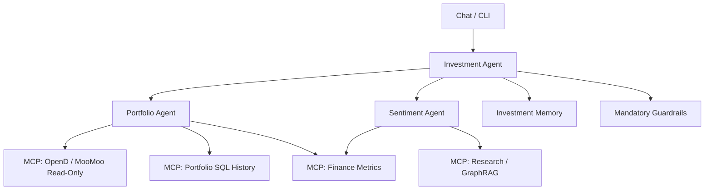

# Personal Finance AI Design

This repository documents and implements a personal multi-agent finance AI. V1
is complete as a Portfolio Agent proof of concept with OpenD and local SQL
portfolio history. V2 added a thin LangGraph Investment Agent with a
bounded-planning Portfolio Agent path and a Sentiment Agent stub. V3 moved MCP
into a backend-owned runtime boundary: gateway modes, the deterministic
portfolio dashboard data lane, and Portfolio/V2 Investment Agent gateway
migration are implemented.

The system is designed for one user's portfolio first. It should analyze actual holdings, current market data, portfolio history, curated research, and long-term investment memory. It must produce source-backed portfolio reviews and investment reasoning without ever placing trades.

## Documents

- [AGENTS.md](docs/finance-ai/AGENTS.md): agent hierarchy, responsibilities, boundaries, and agent-to-agent contracts.
- [ARCHITECTURE.md](docs/finance-ai/ARCHITECTURE.md): system architecture, data stores, MCP servers, orchestration, and deployment shape.
- [ACTION_PLAN.md](docs/finance-ai/ACTION_PLAN.md): current project truth and next work options.
- [PROTOCOL.md](docs/finance-ai/PROTOCOL.md): runtime protocol, state flow, structured events, schemas, and audit records.
- [REQUIREMENTS.md](docs/finance-ai/REQUIREMENTS.md): product, engineering, security, data, and acceptance requirements.
- [ENVIRONMENT.md](docs/finance-ai/ENVIRONMENT.md): project venv, dependency installation, and command conventions.
- [CONNECTOR_TESTS.md](docs/finance-ai/CONNECTOR_TESTS.md): live connector test setup for LLM, MCP, OpenD, SQL, Pinecone, vector retrieval, and Neo4j.
- [MCP_SERVERS.md](docs/finance-ai/MCP_SERVERS.md): local MCP server boundaries, tool/resource lists, agent allowlists, and run commands.
- [TESTING.md](docs/finance-ai/TESTING.md): test responsibility map and why similarly named OpenD, SQL, and MCP tests are not redundant.
- [DECISION_LOG.md](docs/finance-ai/DECISION_LOG.md): project history, design decisions, implementation reality, lessons learned, and future update template.
- [V1_FINALIZATION_PLAN.md](docs/finance-ai/V1_TASKS/V1_FINALIZATION_PLAN.md): V1 closeout record and release gate summary.
- [V1_TASKS/](docs/finance-ai/V1_TASKS/): historical implementation tracking from the V1 build.
- [V3_Tasks/](docs/finance-ai/V3_Tasks/): current MCP runtime, deterministic data lane, and agent-gateway migration task maps.

## Scope

The target system centers on the Investment Agent branch:

- Investment Agent
- Portfolio Agent
- Sentiment Agent
- Read-only MooMoo/OpenD integration
- Deterministic finance metric tools
- Curated research retrieval through GraphRAG
- Pinecone-backed long-term investment memory
- Guardrail and audit protocol

The current complete version is narrower than the target system: a live OpenD
portfolio review through the Portfolio Agent path, SQLite persistence,
deterministic metrics, provider-backed portfolio evaluation, a local chat
frontend, and a deterministic dashboard refresh/status lane that does not
invoke agents or LLMs. Pinecone memory, Neo4j GraphRAG, crypto ingestion, OTC
quote fallback, richer planning/synthesis, and long-term memory remain open.

The future Budgeting, Expenses, and Savings Agent is acknowledged as part of the
long-term product, but it is not part of V2.

## Architecture Diagram

### Agents



## Core Decisions

- No trade placement, ever.
- Investment branch first; no main finance orchestrator needed in V2.
- Python agent layer using LangGraph and LangChain components.
- Local TypeScript/static chatbot frontend exists with streaming status, structured error rendering, report panels, trace output, and a resizable/hideable chat rail.
- Frontend dashboard refresh calls backend APIs; it never calls MCP directly.
- MCP servers are the backend boundary for broker access, portfolio data,
  metrics, future research retrieval, and future memory.
- `StdioMCPToolGateway` uses the official MCP client against local FastMCP
  stdio servers for deterministic backend flows.
- MooMoo/OpenD is the read-only source for current portfolio data.
- OpenD exploration drives the SQL schema and portfolio normalization.
- OpenD unsupported OTC quote snapshots are warnings when positions are still available.
- Account-level `fund_assets` can be treated as effective cash-equivalent purchasing power only when explicitly enabled in local config.
- SQL stores lean portfolio history: daily value snapshots, compact position
  states, allocation weight snapshots, data-quality events, audit logs, and run
  summaries.
- SQL does not store broad raw OpenD blobs, full quote history, hidden
  reasoning, or full final responses.
- Pinecone stores Investment Agent long-term memory, not source-of-truth financial records.
- Neo4j GraphRAG is separate from Pinecone memory.
- V2 Sentiment Agent is a stub; future real sentiment retrieval starts with
  portfolio holdings and Investment Agent-selected scope.
- Outputs must be source-backed, truthful, and clear about missing data.
- No confidence scores. Use explicit uncertainty and limitations instead.

## Local Python Environment

Use the project-local venv for all Python commands:

```bash
source .venv/bin/activate
```

Or call it directly:

```bash
.venv/bin/python -m pytest
.venv/bin/python scripts/run_prototype.py "Review my portfolio"
.venv/bin/python scripts/check_opend.py --env-file config/local.env
.venv/bin/python scripts/debug_opend_trade_calls.py --env-file config/local.env
.venv/bin/python scripts/opend_health_report.py --env-file config/local.env --expected-holdings-count <N>
```

See [ENVIRONMENT.md](docs/finance-ai/ENVIRONMENT.md) for the full setup and verification workflow.
