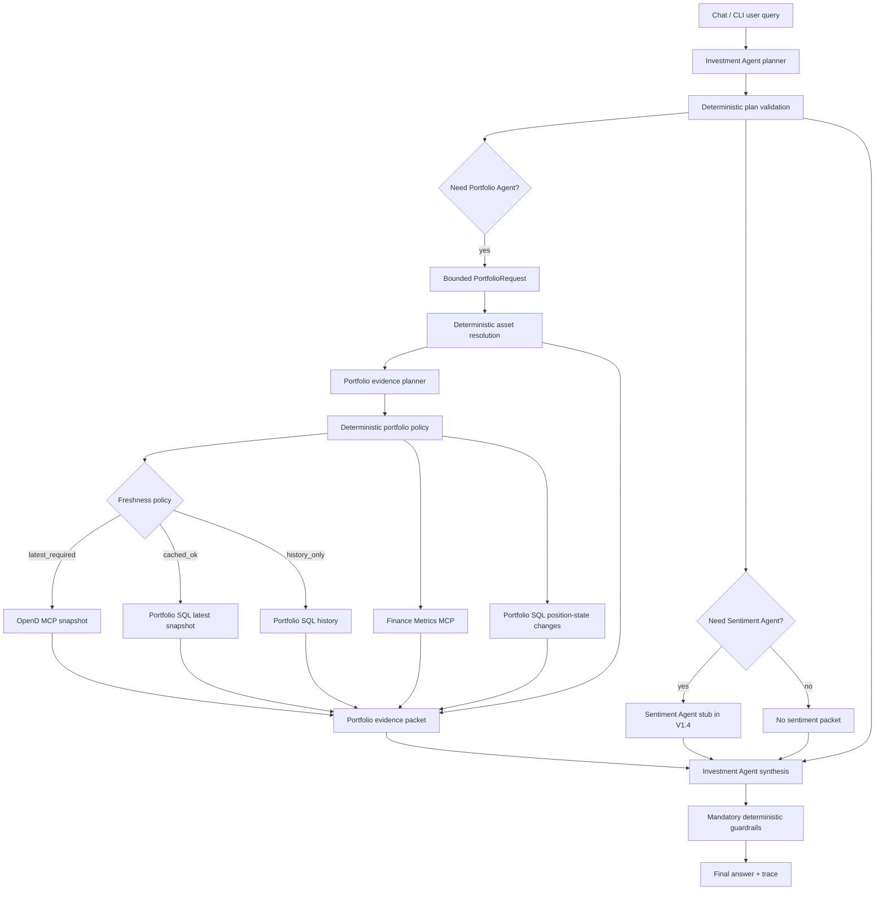

# V1.4 Task Notes

Status: current planning notes. V1.3 MCP gateway, deterministic portfolio data
lane, and agent gateway migration are complete; V1.4 is the next structured
planning track.

## V1.4 Goal

V1.4 should replace temporary deterministic interpretation inside the agent paths
with explicit structured planning while keeping tool execution deterministic.

V1.4 is not a request to make every tool call autonomous. The intended split is:

```text
LLM or guided planner chooses typed intent and scope
  -> deterministic policy validates/refines the plan
  -> MCP tools execute deterministically
  -> LLM synthesizes or explains evidence where useful
  -> deterministic guardrails check final output
```

## Scope

In scope:

- Structured Investment Agent planner.
- Structured Investment-to-Portfolio request contract.
- Structured Portfolio Agent evidence planner.
- Typed plan contracts for task intent, ticker/asset scope, history window,
  freshness requirement, subagent calls, metric groups, and persistence mode.
- Deterministic asset resolution from user-facing symbols/names to portfolio
  assets, SQL asset ids, and OpenD-compatible symbols.
- Deterministic validation and fallback planners for tests/offline mode.
- Trace output showing planner decisions and deterministic policy decisions.

Out of scope:

- Sentiment Agent implementation.
- Neo4j GraphRAG ingestion/retrieval.
- Pinecone memory.
- Trading, order preparation, trade unlock, or executable trade tooling.
- LLM-calculated finance math.

The Sentiment Agent contract may be referenced in V1.4, but implementation remains
a later version.

## Task Files

| Task | File | Purpose |
| --- | --- | --- |
| V1.4.0 | [TASK_0_PLANNER_CONTRACTS.md](TASK_0_PLANNER_CONTRACTS.md) | Define typed contracts for Investment planning, bounded Portfolio requests, asset resolution, Portfolio evidence plans, and evidence packets. |
| V1.4.1 | [TASK_1_ASSET_RESOLUTION_AND_VALIDATION.md](TASK_1_ASSET_RESOLUTION_AND_VALIDATION.md) | Add deterministic asset resolution and validators so logical hints map to actual portfolio assets and invalid plans fail safely. |
| V1.4.2 | [TASK_2_INVESTMENT_AGENT_PLANNER.md](TASK_2_INVESTMENT_AGENT_PLANNER.md) | Replace hidden keyword routing with a structured Investment Agent planner that emits bounded subagent requests. |
| V1.4.3 | [TASK_3_PORTFOLIO_EVIDENCE_PLANNER.md](TASK_3_PORTFOLIO_EVIDENCE_PLANNER.md) | Refactor Portfolio Agent planning into evidence planning over bounded requests, resolved assets, history scope, metrics, and freshness needs. |
| V1.4.4 | [TASK_4_DETERMINISTIC_EXECUTION_AND_EVIDENCE_PACKET.md](TASK_4_DETERMINISTIC_EXECUTION_AND_EVIDENCE_PACKET.md) | Execute Portfolio evidence plans deterministically and return facts, metrics, patterns, interpretations, limitations, and trace. |
| V1.4.5 | [TASK_5_TRACE_EVALUATION_AND_CLOSEOUT.md](TASK_5_TRACE_EVALUATION_AND_CLOSEOUT.md) | Expose planner/execution trace, add golden prompt evaluations, update docs, and close the V1.4 gate. |

## Cross-Task Dependency Map

```text
V1.4.0. Planner contracts
  ├── V1.4.1. Asset resolution and validation
  │   ├── V1.4.2. Investment Agent planner
  │   │   └── V1.4.3. Portfolio evidence planner
  │   │       └── V1.4.4. Deterministic execution and evidence packet
  │   │           └── V1.4.5. Trace, evaluations, docs, and closeout
  │   └── V1.4.4. Deterministic execution uses validated resolved assets
  └── V1.4.5. Docs and tests validate the final contract set
```

## Core Design Clarification

The Investment Agent should not send a free-form natural-language instruction
and hope the Portfolio Agent understands it. It should send a bounded structured
portfolio request with typed options plus the original user query for context.

Recommended contract shape:

```text
Investment Agent sends:
  - bounded portfolio task intent
  - logical ticker/name/entity hints, not broker-specific identifiers
  - time range
  - freshness requirement
  - output goals
  - original user query

Portfolio Agent returns:
  - resolved portfolio assets and canonical identifiers
  - deterministic tool evidence
  - derived metrics and position changes
  - portfolio-only patterns, anomalies, and caveats
  - limitations and any evidence needs for sentiment/fundamentals
```

This means the Portfolio Agent is not a second mission planner. It should not
override the Investment Agent's goal or decide whether the Sentiment Agent is
needed. Its planning is portfolio-evidence planning: translating the bounded
request into actual portfolio data access, calculations, and portfolio-specific
insight extraction.

The Portfolio Agent should add value by acting like a portfolio analyst
assistant. It should surface what is important or unusual so the Investment
Agent does not need to inspect every holding, metric, and history row manually.
It must clearly separate:

- deterministic facts
- derived metrics
- detected patterns and outliers
- portfolio-only interpretation
- limitations that require sentiment, fundamentals, or market context

## Responsibility Split

### Investment Agent

The Investment Agent owns mission-level planning and final synthesis.

Its planner should decide:

- user intent and mode
- whether Portfolio Agent is needed
- whether Sentiment Agent is needed
- bounded portfolio task intent requested from the Portfolio Agent
- logical ticker, company, asset, theme, and time-horizon hints
- sentiment task requested from the Sentiment Agent stub or future agent
- freshness requirement: `latest_required`, `cached_ok`, or `history_only`
- answer style and constraints
- guardrail-relevant constraints such as no trade execution

Its planner should not decide:

- broker-specific symbols such as OpenD's `US.AAPL`
- SQL asset ids
- whether a user-provided ticker/name actually exists in the portfolio
- exact SQL query sequence
- exact OpenD calls
- metric formulas
- cost-basis calculations
- final freshness enforcement

Investment Agent ticker scope is logical, not canonical. For example, it may
request `AAPL` or `Apple`, but Portfolio Agent or a deterministic Asset
Resolver should map that to the actual portfolio asset and OpenD-compatible
symbol such as `US.AAPL`, or return an unresolved/ambiguous asset warning.

### Portfolio Agent

The Portfolio Agent owns portfolio evidence planning and portfolio facts.

Its planner should decide:

- how to resolve logical ticker/name/entity hints into portfolio assets
- whether the Investment Agent's requested portfolio task needs refinement into
  portfolio evidence subtasks
- relevant canonical tickers, SQL asset ids, and OpenD symbols for portfolio
  evidence
- SQL history tools needed for the requested evidence
- whether position-state changes should be asset-scoped, ticker-scoped, or
  portfolio-wide
- metric groups required
- whether current portfolio context is needed by the requested portfolio task
- persistence mode: `persist`, `skip`, or policy-driven `auto`
- portfolio-only patterns, anomalies, concentration issues, allocation drift,
  cash/cash-equivalent effects, and historical changes worth highlighting

Its planner should not decide:

- the user's main investment mission if the Investment Agent already provided a
  valid bounded task
- whether market sentiment is needed for the final user answer
- whether to invoke Sentiment Agent
- final investment recommendation
- trade sizing or execution instructions

If the Investment Agent sends an incomplete or inconsistent portfolio request,
the Portfolio Agent should normalize it within bounded rules, emit warnings, or
return a request-validation error. It should not silently invent a new mission.

The Portfolio Agent may use an LLM for compact portfolio-only explanation and
pattern ranking, but it should not use an LLM for finance math, asset
resolution, broker calls, SQL reads, or persistence decisions.

### Asset Resolver

A deterministic Asset Resolver should sit inside or immediately beside the
Portfolio Agent. It maps user-facing asset hints to canonical local portfolio
entities.

Inputs:

- raw user hint such as `AAPL`, `Apple`, or an existing portfolio display name
- optional market hint from the Investment Agent
- portfolio/account scope
- latest SQL asset identities and/or current OpenD positions

Outputs:

- canonical symbol used by the portfolio, for example `US.AAPL`
- SQL `asset_id` when known
- display name
- resolution status: `resolved`, `ambiguous`, `not_in_portfolio`,
  `unsupported_market`, or `unknown`
- warnings for misspellings, OTC limitations, crypto/cash-sweep exclusions, or
  non-US assets outside the current scope

The Investment Agent should not need to know OpenD symbol conventions. It should
send logical intent; the Portfolio Agent resolves that intent against the actual
portfolio.

### Deterministic Portfolio Policy

Freshness and tool execution should be deterministic after planning.

The Investment Agent may set a freshness requirement, and the Portfolio Agent
may state whether its portfolio task depends on current values. The backend or
Portfolio Agent policy then decides:

- if `latest_required`, call OpenD through the MCP gateway
- if `cached_ok` and the latest SQL snapshot is fresh enough, avoid OpenD
- if `history_only`, read SQL history without OpenD
- if cached data is stale and the task needs current values, call OpenD or
  return a stale-data warning if OpenD is unavailable
- whether a run should persist a new observation based on policy and task type

This policy should be testable without an LLM.

### Sentiment Agent

Sentiment Agent implementation is not part of V1.4.

Future responsibilities remain:

- research/retrieval planning
- ticker/entity/theme/document-type scope
- GraphRAG/vector retrieval
- evidence synthesis with citations
- contradictions, risks, catalysts, and missing-data warnings

In V1.4, Sentiment Agent can remain a stub that receives structured tasks. The
Investment Agent planner may decide that sentiment would be needed, but V1.4 does
not build the real GraphRAG system.

## LLM Needed Or Not

### Investment Agent Tasks

| Task | LLM or guided planner? | Deterministic? | Notes |
| --- | --- | --- | --- |
| Interpret ambiguous user query | Yes | No | Main use of the Investment Agent planner. |
| Classify mode/task | Yes, with deterministic fallback | Fallback only | Current keyword classifier is temporary. |
| Select subagents | Yes | Validated deterministically | Planner chooses Portfolio/Sentiment needs. |
| Select logical tickers/entities/themes/time horizon | Yes | Validated deterministically | Logical hints only; not OpenD/SQL identifiers. |
| Choose broker symbols or SQL asset ids | No | No | Belongs to Portfolio Agent Asset Resolver. |
| Set freshness requirement | Yes | Policy enforces | Planner chooses `latest_required`, `cached_ok`, or `history_only`. |
| Enforce freshness | No | Yes | Deterministic backend/Portfolio policy. |
| Synthesize portfolio + sentiment + IPS | Yes | No | Rich final reasoning belongs here. |
| Guardrails | Optional LLM later | Yes first | Deterministic guardrails remain mandatory. |

### Portfolio Agent Tasks

| Task | LLM or guided planner? | Deterministic? | Notes |
| --- | --- | --- | --- |
| Validate bounded portfolio request | No | Yes | Ensure Investment Agent request is allowed and coherent. |
| Resolve logical ticker/name to portfolio asset | No | Yes | Asset Resolver maps to SQL asset ids and OpenD symbols. |
| Refine evidence subtasks from request | Optional, bounded | Validated deterministically | Only within the requested portfolio mission. |
| Select SQL history tools | Optional, bounded | Validated deterministically | Tool names come from allowlisted plan fields. |
| Decide current-context dependency | Optional, bounded | Policy validated | Planner can say task needs current values. |
| Check SQL freshness | No | Yes | Deterministic. |
| Check OpenD connection | No | Yes | Deterministic. |
| Pull OpenD snapshot | No | Yes | Deterministic MCP call. |
| Read SQL history | No | Yes | Deterministic MCP call. |
| Calculate metrics | No | Yes | Deterministic finance tools. |
| Calculate position-state changes | No | Yes | Deterministic SQL/MCP tool. |
| Detect threshold-based outliers | No | Yes | Concentration, drift, cash, stale data, large changes. |
| Rank or explain portfolio-only patterns | Optional | No | Useful for analyst-style evidence summaries. |
| Decide market sentiment or final thesis | No | No | Belongs to Sentiment Agent / Investment Agent synthesis. |

### Sentiment Agent Tasks

Not implemented in V1.4. Future classification:

| Task | LLM or guided planner? | Deterministic? | Notes |
| --- | --- | --- | --- |
| Select research query expansions | Yes | No | Future GraphRAG phase. |
| Retrieve by ticker/entity/date/type | No | Yes | Deterministic retrieval once query is formed. |
| Rank retrieved chunks | Mostly no | Yes | Retrieval scoring. |
| Summarize source evidence | Yes | No | Source-backed synthesis. |
| Extract citations mechanically | No | Yes | Citation mechanics should be deterministic. |

## Proposed V1.4 Flow



## Planner Contracts To Design

### Investment Plan

Candidate fields:

```json
{
  "mode": "review | risk_check | what_changed | deep_dive | compare | portfolio_fact",
  "needs_portfolio_agent": true,
  "needs_sentiment_agent": false,
  "portfolio_request": {},
  "sentiment_task": null,
  "asset_hints": ["AMZN"],
  "themes": [],
  "time_horizon": "90d",
  "freshness_requirement": "latest_required | cached_ok | history_only",
  "answer_constraints": ["no_trade_execution"],
  "warnings": []
}
```

### Portfolio Plan

Candidate request fields from Investment Agent:

```json
{
  "task_intent": "full_review | portfolio_fact | risk_check | what_changed | deep_dive | compare",
  "asset_hints": ["AMZN"],
  "time_range": "90d",
  "freshness_requirement": "latest_required | cached_ok | history_only",
  "output_goals": ["position_changes", "allocation_context", "portfolio_patterns"],
  "source_query": "What price did I buy my recent AMZN shares at?"
}
```

Candidate Portfolio Agent execution plan fields:

```json
{
  "task_intent": "what_changed",
  "resolved_assets": [
    {
      "input": "AMZN",
      "canonical_symbol": "US.AMZN",
      "asset_id": "asset_123",
      "resolution_status": "resolved"
    }
  ],
  "history_window": "90d",
  "freshness_requirement": "latest_required",
  "needs_current_values": true,
  "history_queries": [
    "history_status",
    "latest_state",
    "portfolio_growth",
    "allocation_history",
    "position_state_changes"
  ],
  "metric_groups": ["allocation", "effective_cash", "performance"],
  "position_change_scope": "ticker_scoped",
  "persistence_mode": "auto",
  "pattern_detection": ["large_quantity_change", "average_cost_shift"],
  "warnings": []
}
```

Candidate portfolio evidence packet sections:

```json
{
  "facts": {},
  "derived_metrics": {},
  "position_changes": [],
  "detected_patterns": [],
  "portfolio_only_interpretation": [],
  "limitations": [
    "No sentiment or fundamental evidence was reviewed by Portfolio Agent."
  ],
  "needs_sentiment_context": []
}
```

## Temporary Fallbacks

Current implementation note:

- `interpret_portfolio_task()` still extracts tickers with a deterministic
  regex helper.
- `portfolio_sql_get_position_state_changes` can receive a ticker parameter,
  but the choice of which ticker to pass is still made by the temporary bounded
  planner.

V1.4 target:

- Move ticker and asset-scope selection out of `interpret_portfolio_task()`.
- Represent ticker/asset scope as planner output.
- Represent Investment Agent to Portfolio Agent communication as a bounded
  `PortfolioRequest`, not free-form natural language.
- Add deterministic asset resolution so logical hints like `AAPL` or `Apple`
  map to portfolio assets and OpenD-compatible symbols such as `US.AAPL`.
- Keep Portfolio Agent task refinement limited to evidence planning. It should
  not re-decide the user mission once the Investment Agent has sent a valid
  bounded request.
- Make Portfolio Agent value-add explicit through pattern/outlier detection,
  portfolio-only interpretation, and limitations that tell the Investment Agent
  what requires sentiment or fundamental context.
- Keep a deterministic fallback planner for tests and offline mode, but make it
  explicit that it is a fallback implementation.
- Add tests proving a planner can choose `AMZN` for a query like "What price did
  I buy my recent AMZN shares at?" and that execution passes that ticker to
  `portfolio_sql_get_position_state_changes`.

## Non-Goals

- Do not implement real Sentiment Agent retrieval in V1.4.
- Do not let the LLM directly calculate cost basis or inferred purchase price.
- Do not make tool execution autonomous after planning.
- Do not remove deterministic tests; use fake planner outputs for stable tests.
- Do not allow trade placement, order preparation, or executable share-count
  recommendations.
