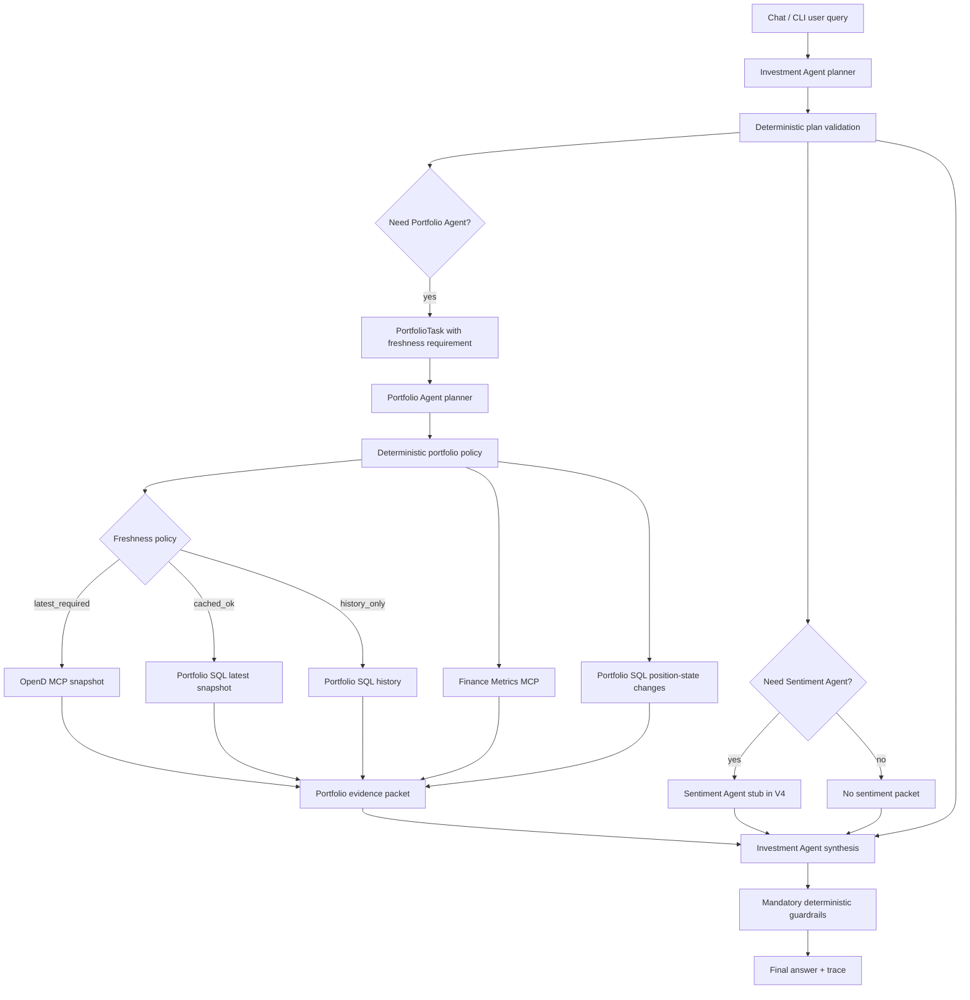

# V4 Task Notes

Status: future planning notes. V4 is not scheduled until the V3 MCP gateway,
deterministic portfolio data lane, and agent gateway migration are complete.

## V4 Goal

V4 should replace temporary deterministic interpretation inside the agent paths
with explicit structured planning while keeping tool execution deterministic.

V4 is not a request to make every tool call autonomous. The intended split is:

```text
LLM or guided planner chooses typed intent and scope
  -> deterministic policy validates/refines the plan
  -> MCP tools execute deterministically
  -> LLM synthesizes or explains evidence where useful
  -> deterministic guardrails check final output
```

## Scope

In scope:

- Structured Investment Agent planner.
- Structured Portfolio Agent planner.
- Typed plan contracts for task type, ticker/asset scope, history window,
  freshness requirement, subagent calls, metric groups, and persistence mode.
- Deterministic validation and fallback planners for tests/offline mode.
- Trace output showing planner decisions and deterministic policy decisions.

Out of scope:

- Sentiment Agent implementation.
- Neo4j GraphRAG ingestion/retrieval.
- Pinecone memory.
- Trading, order preparation, trade unlock, or executable trade tooling.
- LLM-calculated finance math.

The Sentiment Agent contract may be referenced in V4, but implementation remains
a later version.

## Responsibility Split

### Investment Agent

The Investment Agent owns mission-level planning and final synthesis.

Its planner should decide:

- user intent and mode
- whether Portfolio Agent is needed
- whether Sentiment Agent is needed
- broad ticker, asset, theme, and time-horizon scope
- portfolio task requested from the Portfolio Agent
- sentiment task requested from the Sentiment Agent stub or future agent
- freshness requirement: `latest_required`, `cached_ok`, or `history_only`
- answer style and constraints
- guardrail-relevant constraints such as no trade execution

Its planner should not decide:

- exact SQL query sequence
- exact OpenD calls
- metric formulas
- cost-basis calculations
- final freshness enforcement

### Portfolio Agent

The Portfolio Agent owns portfolio evidence planning and portfolio facts.

Its planner should decide:

- portfolio task type
- relevant tickers or asset ids for portfolio evidence
- history window
- SQL history tools needed
- whether position-state changes should be ticker-scoped or portfolio-wide
- metric groups required
- whether current portfolio context is needed by the requested portfolio task
- persistence mode: `persist`, `skip`, or policy-driven `auto`

Its planner should not decide:

- whether market sentiment is needed for the final user answer
- whether to invoke Sentiment Agent
- final investment recommendation
- trade sizing or execution instructions

### Deterministic Portfolio Policy

Freshness and tool execution should be deterministic after planning.

The Investment Agent may set a freshness requirement, and the Portfolio Agent
may state whether its portfolio task depends on current values. The backend or
Portfolio Agent policy then decides:

- if `latest_required`, call OpenD through the MCP gateway
- if `cached_ok` and the latest SQL snapshot is fresh enough, avoid OpenD
- if `history_only`, read SQL history without OpenD
- if cached data is stale and the task needs current values, call OpenD or
  return a stale-data warning if OpenD is unavailable
- whether a run should persist a new observation based on policy and task type

This policy should be testable without an LLM.

### Sentiment Agent

Sentiment Agent implementation is not part of V4.

Future responsibilities remain:

- research/retrieval planning
- ticker/entity/theme/document-type scope
- GraphRAG/vector retrieval
- evidence synthesis with citations
- contradictions, risks, catalysts, and missing-data warnings

In V4, Sentiment Agent can remain a stub that receives structured tasks. The
Investment Agent planner may decide that sentiment would be needed, but V4 does
not build the real GraphRAG system.

## LLM Needed Or Not

### Investment Agent Tasks

| Task | LLM or guided planner? | Deterministic? | Notes |
| --- | --- | --- | --- |
| Interpret ambiguous user query | Yes | No | Main use of the Investment Agent planner. |
| Classify mode/task | Yes, with deterministic fallback | Fallback only | Current keyword classifier is temporary. |
| Select subagents | Yes | Validated deterministically | Planner chooses Portfolio/Sentiment needs. |
| Select broad tickers/themes/time horizon | Yes | Validated deterministically | Avoid inline regex as the primary path. |
| Set freshness requirement | Yes | Policy enforces | Planner chooses `latest_required`, `cached_ok`, or `history_only`. |
| Enforce freshness | No | Yes | Deterministic backend/Portfolio policy. |
| Synthesize portfolio + sentiment + IPS | Yes | No | Rich final reasoning belongs here. |
| Guardrails | Optional LLM later | Yes first | Deterministic guardrails remain mandatory. |

### Portfolio Agent Tasks

| Task | LLM or guided planner? | Deterministic? | Notes |
| --- | --- | --- | --- |
| Choose portfolio task type | Yes, with fallback | Fallback only | Replace keyword path in V4. |
| Select ticker/asset scope | Yes, with fallback | Fallback only | Planner output, not inline regex. |
| Select SQL history tools | Yes, bounded | Validated deterministically | Tool names come from allowlisted plan fields. |
| Decide current-context dependency | Yes, bounded | Policy validated | Planner can say task needs current values. |
| Check SQL freshness | No | Yes | Deterministic. |
| Check OpenD connection | No | Yes | Deterministic. |
| Pull OpenD snapshot | No | Yes | Deterministic MCP call. |
| Read SQL history | No | Yes | Deterministic MCP call. |
| Calculate metrics | No | Yes | Deterministic finance tools. |
| Calculate position-state changes | No | Yes | Deterministic SQL/MCP tool. |
| Explain portfolio-only findings | Optional | No | Useful for natural-language explanation only. |

### Sentiment Agent Tasks

Not implemented in V4. Future classification:

| Task | LLM or guided planner? | Deterministic? | Notes |
| --- | --- | --- | --- |
| Select research query expansions | Yes | No | Future GraphRAG phase. |
| Retrieve by ticker/entity/date/type | No | Yes | Deterministic retrieval once query is formed. |
| Rank retrieved chunks | Mostly no | Yes | Retrieval scoring. |
| Summarize source evidence | Yes | No | Source-backed synthesis. |
| Extract citations mechanically | No | Yes | Citation mechanics should be deterministic. |

## Proposed V4 Flow



## Planner Contracts To Design

### Investment Plan

Candidate fields:

```json
{
  "mode": "review | risk_check | what_changed | deep_dive | compare | portfolio_fact",
  "needs_portfolio_agent": true,
  "needs_sentiment_agent": false,
  "portfolio_task": {},
  "sentiment_task": null,
  "tickers": ["AMZN"],
  "themes": [],
  "time_horizon": "90d",
  "freshness_requirement": "latest_required | cached_ok | history_only",
  "answer_constraints": ["no_trade_execution"],
  "warnings": []
}
```

### Portfolio Plan

Candidate fields:

```json
{
  "task_type": "full_review | portfolio_fact | risk_check | what_changed | deep_dive | compare",
  "tickers": ["AMZN"],
  "asset_ids": [],
  "history_window": "90d",
  "freshness_requirement": "latest_required",
  "needs_current_values": true,
  "history_queries": [
    "history_status",
    "latest_state",
    "portfolio_growth",
    "allocation_history",
    "position_state_changes"
  ],
  "metric_groups": ["allocation", "effective_cash", "performance"],
  "position_change_scope": "ticker_scoped",
  "persistence_mode": "auto",
  "warnings": []
}
```

## Temporary Fallbacks

Current implementation note:

- `interpret_portfolio_task()` still extracts tickers with a deterministic
  regex helper.
- `portfolio_sql_get_position_state_changes` can receive a ticker parameter,
  but the choice of which ticker to pass is still made by the temporary bounded
  planner.

V4 target:

- Move ticker and asset-scope selection out of `interpret_portfolio_task()`.
- Represent ticker/asset scope as planner output.
- Keep a deterministic fallback planner for tests and offline mode, but make it
  explicit that it is a fallback implementation.
- Add tests proving a planner can choose `AMZN` for a query like "What price did
  I buy my recent AMZN shares at?" and that execution passes that ticker to
  `portfolio_sql_get_position_state_changes`.

## Non-Goals

- Do not implement real Sentiment Agent retrieval in V4.
- Do not let the LLM directly calculate cost basis or inferred purchase price.
- Do not make tool execution autonomous after planning.
- Do not remove deterministic tests; use fake planner outputs for stable tests.
- Do not allow trade placement, order preparation, or executable share-count
  recommendations.
